# MapReduce程序分析

首先，要说明的是本文主要基于`CPU pprof`进行优化，`pprof`的代码在`urltop10_test.go`中的`testURLTop()`
中。关于本文对程序的分析主要是性能分析，性能分析主要聚焦于以下两个方面：

1. 对`mapreduce.go`代码性能优化
2. 基于`urltop10_example.go`的对`mapF()`和`reduceF()`的优化，也就是
`urltop10.go`的实现的idea的阐述

因为在写完`mapreduce.go`的代码后就可以跑通`urltop10_example.go`的代码，因此会首先阐述对
`mapreduce.go`的优化过程，再就是对`urltop10_example.go`的`mapF()`和`reduceF()`的优化。

## 1. `mapreduce.go`代码的性能优化

在补全了`mapreduce.go`中的`worker()`和`run()`的代码后，跑通了`urltop10_example.go`的测试(说明：由于
机器配置原因，在处理100M及以上的文件时会超过10min，故修改了timeout的值)。初次测试所得的`pprof`的
`top25`如下图所示：

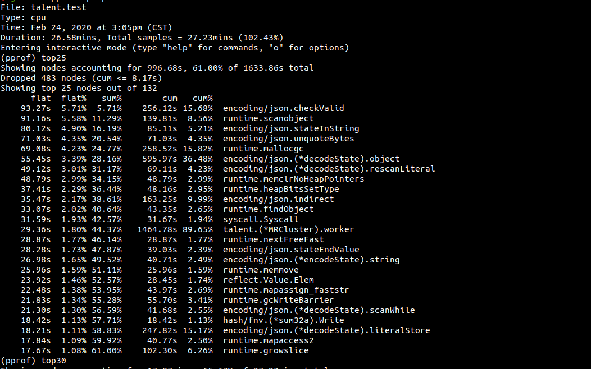

简单总结下可得出是以下三个方面占用了主要的耗时操作(由高到低)：

1. `worker()`函数
2. `encoding/json` (数据序列化与反序列化) 
3. `GC`

基于以上三点，我们可以分别对其进行相应的优化。其中，`worker()`函数的优化实际上就是主要由2和3组成。因
此，归结起来，对`mapreduce.go`的优化主要就是对`worker()`函数的优化。对`worker()`的优化实际上就是对
`encoding/json`和`GC`的优化。

- **`encoding/json` (数据序列化与反序列化)的优化**
在该阶段的优化过程中，尝试了以下三个步骤的逐步优化：

    1. 序列化工具包的替换
    2. 改变存储`key-value`的数据结构
    3. 去除序列化与反序列化

- **`GC`的优化**
对于`GC`的优化，主要是要降低创建对象的频次，尽可能复用变量以及尽可能地优化存在多次内存分配的代码(例
如：使用切片时在已知存放元素的数目的情况下，直接分配容量)，以此降低`GC`过程中的对象扫描及内存释放等
相关问题。

### 1.1. 序列化工具包的替换及`GC`的初步优化

1. **序列化工具包的替换**

在给出的初始代码中，序列化工具包是`encoding/json`。但是，`encoding/json`的序列化与反序列化性能并不是
最优的。在已知的几个`Go`的序列化工具包中，`json-iterator`是相对最优的。因此，我们可以使用
`json-iterator`包替换`encoding/json`。替换后的`pprof`分析如下：

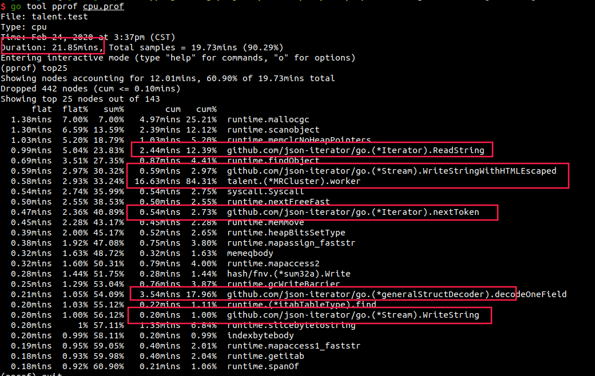

对比未替换前可知(前一张图片)，整体时间上缩短了大概5min(26.58min - 21.85min)，效率上有一定的提升。

2. **`GC`的初步优化**
首先，从`CPU`占用比来看，除了`worker()`最大，其次就是`GC`相关的函数(如下图所示)。因此，我们可以考虑修改代码以优
化`GC`。

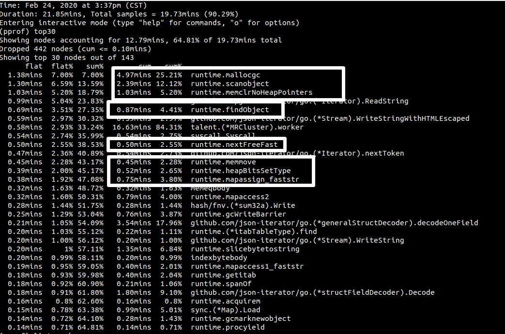

前面提到，在本程序中`GC`的优化目标就是尽可能减少对象的创建及尽可能复用变量。而在`worker()`中，我们可
以优化的是`map`阶段创建的`jsoniter.Encoder`对象：

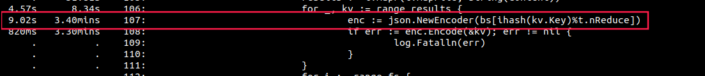

**优化的思路**：使用map将key相同的`jsoniter.Encoder`对象指针存储起来，减少对象的创建。代码如下：

```go 
encoderMap := make(map[string]*jsoniter.Encoder)
for _, kv := range results { 
    if _, ok := encoderMap[kv.Key]; !ok { 
        encoderMap[kv.Key] = json.NewEncoder(bs[ihash(kv.Key)%t.nReduce]) 
    } 
    if err := encoderMap[kv.Key].Encode(&kv); err != nil { 
        log.Fatalln(err) 
    } 
} 
```

再一次测试`urltop10_example.go`的代码，`pprof`结果如下：

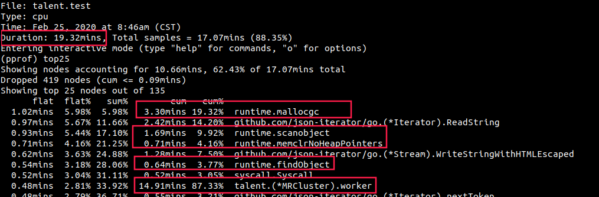

首先，从总体时间上看，缩短了大概2.5min(21.85min - 19.32min)；从`worker()`耗时看也有了下降；`GC`相关
的各个函数的耗时也都有了下降。当然，我们还可以对比一下优化前后的`svg`图中的`GC`部分：

优化前的`svg`中的`GC`图：

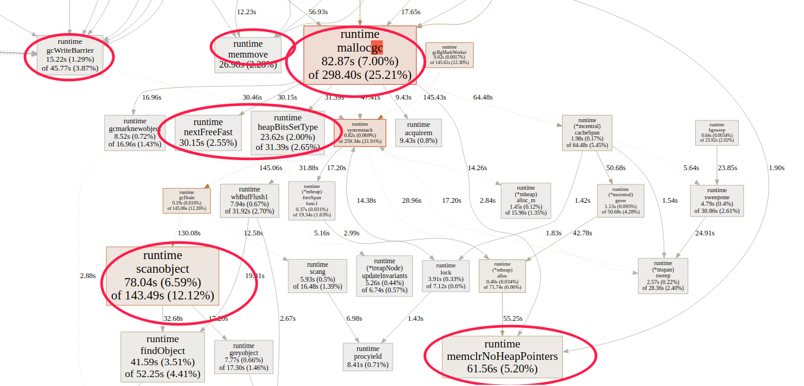

优化后的`svg`中的`GC`图：

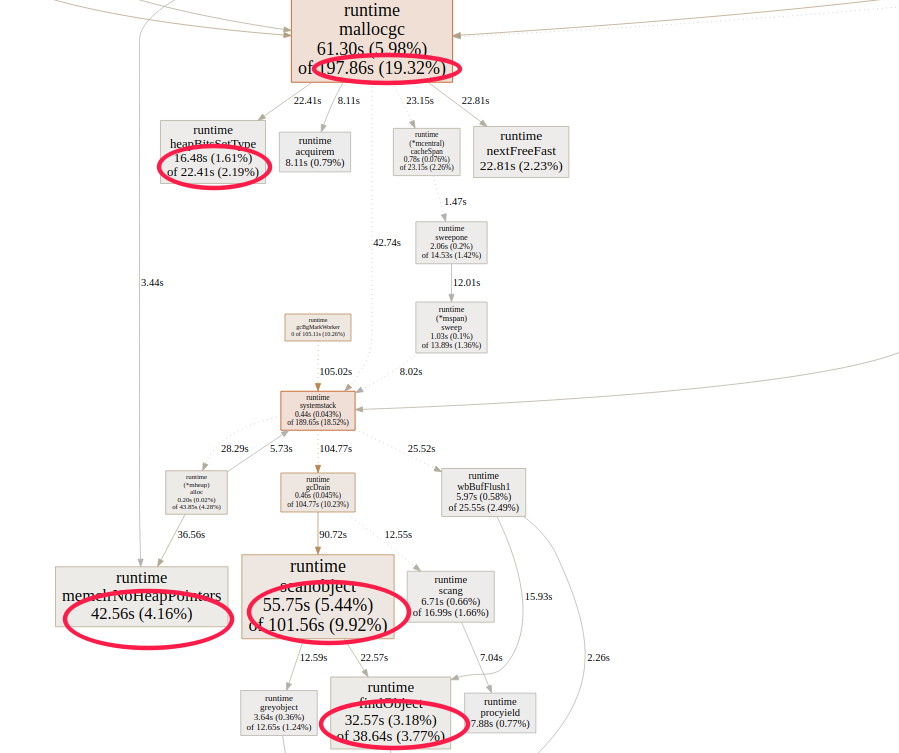

前后对比，可以看出`GC`耗时降低了`100s`左右。

### 1.2. 存储`key-value`的数据结构的改变。

在替换了序列化工具包及初步优化`GC`后，耗时的大头仍是序列化与反序列化。那么在必须要进行序列化的情况下
，我们还可以考虑通过改变存储`key-value`的数据结构来试着进行优化。对于数据结构的改变，既能替换结构体
能，又能方便的访问`key-value`的复合数据类型无外乎就是`map`、`slice`和`array`。在本程序中，`map`并不
适合，而`slice`的底层数据结构是结构体，其存储的是数组指针，因此我们可以将其排除在外。通过对`struct`
与`array`做简单的`benchmark`测试，1000万的数据序列化的效率`array`仅比`struct`快`8s`。对于本程序而言
，数据量有一定规模，因此可以尝试着使用`array`替换`KeyValue`。其中，`array`的数据结构为：
`type KVArray [2]string`。`KVArray`和`KeyValue`的测试结果所得的`svg`图如下：

采用`KVArray`的`svg`图中的序列化操作耗时：

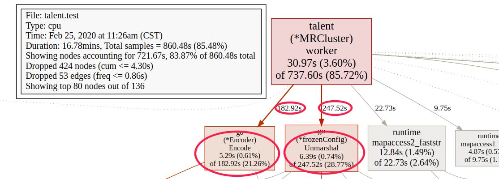

采用`KeyValue`的`svg`图中的序列化操作耗时：


在整个程序运行时间上缩短了大概2min(19.32min - 16.78min)，也算是一次小小的优化吧。对于改变存储`key-value`
的数据结构这一尝试，不知道是否符合要求，主要是改变了原有的以`struct`表示`key-value`的方式。当然，针
对本程序解决的问题，个人认为并没有什么影响。

### 1.3. 去除序列化与反序列化

该优化的来由主要是从两方面考虑得来：

1. 纵观整个程序，在存储`key-value`的数据结构中，我们并没有充分使用到`struct`或者`array`中分配的内存
   空间。例如，当我们使用`struct`时，在`round1`阶段和`round2`阶段，我们都只使用了`key`或`value`成员
   。为此，个人认为该处是可以优化的，也尝试了直接使用`string`存储`key-value`。
2. 无论如何改变存储`key-value`的数据结构，序列化与反序列化操作的耗时始终占主要部分。而基于第一点的阐
   述，我们是可以直接去除序列化与反序列化操作，改用字符串操作即可存储`key-value`到中间文件或是从中间
   文件获取`key`和`value`。

在该优化过程中，笔者一共尝试了两种方式：

- **方式1**：直接使用`string`替换存储`key-value`的复杂数据结构，采用分隔符连接`key`和`value`
- **方式2**： 保留存储`key-value`的复杂数据结构，但是改变存储到中间文件的`key-value`的形式，采用分隔
符连接`key`和`value`

现在总结时看来，二者的共同之处就在于改变了`key-value`存储到中间文件的形式，其他的也就是数据结构的区
别。以下是详细的尝试过程：

笔者首先想到的是方式1，因为这样正好解决了内存浪费问题。但是在该过程中，发生了**一个令人匪夷所思的问
题**：表象问题是在对`url`频次排序的过程中，对频次值执行`strconv.Atoi()`操作时报错，试着输出报错的数
据时发现是乱码。当笔者进一步检查时发现，前面提到的`strconv.Atoi()`报错并不总是发生。当
`strconv.Atoi()`不报错时，会出现另一个问题——round2的`reduce`结果的`CheckFile()`阶段出现部分`url`统计
频次不一致的问题。基于以上两个问题，笔者进一步定位出原因：在`worker()`的`reduce`阶段读取文件后，一次
性将文件数据类型从`[]byte`转为`string`时发生了数据丢失。但是，**最奇怪的来了**：以上问题的出现是在测
试所有不同大小文件的`case`时出现在处理`1GB`的文件中的`case8`中，当笔者单独测试`1GB`的所有`case`时，
以上两个问题都不会出现。遗憾的是，笔者在完成代码后写这篇文档时，仍未找出更深层的原因，只是规避了这个
问题，规避的方式很简单：不执行一次性类型转换从而避免数据丢失，而是在对`[]byte`型的`content`按照`\n`
拆分成切片后，对切片中的每一个元素执行类型转换。
  
对于方式2，实际上就是保留了原有存储`key-value`的数据结构，其他的与方式1的处理一致。数据结构采用的是
`struct`类型的`KeyValue`，在无序列化与反序列化操作中采用`array`存储并没有什么明显的优势并且`key`与
`value`的访问方式在可读性上弱于`struct`类型的`KeyValue`。方式2测试后生成的`cpu pprof`分析如下：

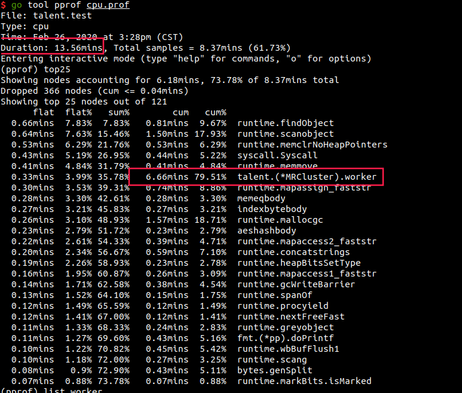

从总体时间上看，与前面的`GC`优化对比，耗时缩短了大概6分钟(19.32min - 13.56min)，其中`worker()`的耗时
缩短了57%(6.66min, 14.91min)。下面我们来看看`worker()`中的`Key`和`Value`的存储与获取的耗时：

- `map`阶段的`Key`和`Value`的存储操作：
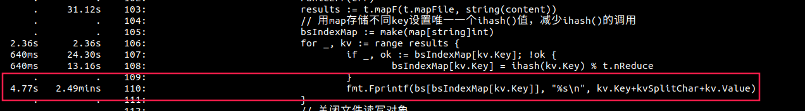
- `reduce`阶段的`Key`和`Value`的解析操作：
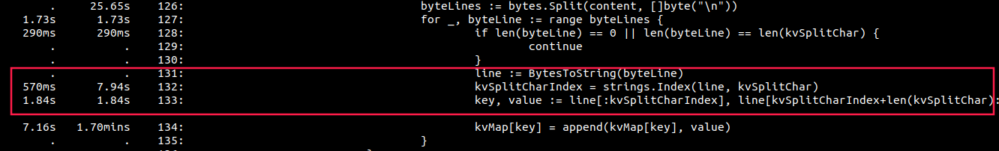

从以上两张图看，在去除序列化与反序列化操作后，耗时骤降。

## 2. mapF()与reduceF()的优化

### 2.1. `mapF()`的优化

- `round1`中的`URLCountMap()`：该`map`函数没有想出有什么可以优化的地方，因此与`urltop10_example.go`
  中的`ExampleURLCountMap()`一致
- `round2`中的在`URLTop10Map()`：该`map`函数是对完成频次统计的`url`进行排序，它对应的`mapreduce`函数
  基于多个文件排序的结果求出最终的`top10`。而我们知道，在`round`的`reudce`阶段通过`shuffle`处理已经
  将相同的`url`都集中在同一个文件中。因此，我们可以直接在`map`排序阶段求出每个文件的`top10`以供
  `reduceF()`处理即可。

### 2.2. `reduceF()`的优化

- `round1`的`URLCountReduce()`：该`reduce`函数主要就是将url及其频次拼接成一个字符串，在
`urltop10_example.go`中的`ExampleURLCountReduce()`采用`fmt.Sprintf()`方法。而对于短字符串的拼接，相
对最高效的是使用`+`拼接。因此，此处可以做的优化就是改为`+`拼接字符串。
- `round2`的`URLTop10Reduce()`：该`reduce`函数也没有想出可优化的地方，故没做改变。

### 2.3. `TopN()`的优化

除了对`mapF()`与`reduceF()`的优化，笔者还对`topN()`函数进行了一定的修改。在`urltop10_example.go`中，
`TopN()`是直接使用`sort.Slice()`进行全排序取前`N`个元素。笔者分别尝试了基于最小堆的全排序及基于
`hash`的计数排序，最终采用的是基于`hash`的计数排序，在两种排序中，对于短序列均直接采用插入排序。

以上便是对`mapF()`及`reudceF()`的优化的尝试，虽然在这些优化在整个程序中的属于低优先级的优化目标，笔者还是
尝试去做了下。下面是优化后的`pprof`分析，为了节省时间，该`pprof`只测试了`1GB`数据的11个`case`：

**`urltop10_example.go`中的`mapF()`与`reduceF()`的耗时**
- `mapF()`

- `reduceF()`
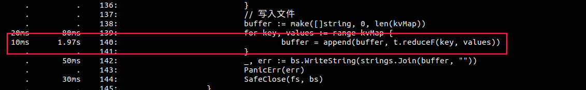

**`urltop10.go`中的`mapF()`与`reduceF()`的耗时**
- `mapF()`
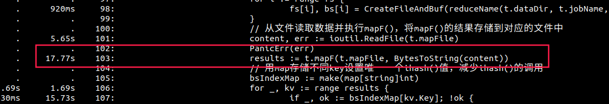
- `reduceF()`
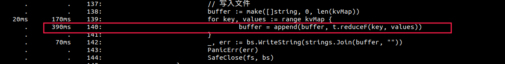

## 3. 总结

在完成最后的优化尝试后，笔者再次执行发现，虽然`worker()`进行了较大的优化，但是`GC`仍然居高不下。例如
，仅测试`1GB`的数据的11个`case`时，总耗时为9.61min，`worker()`耗时为5min，`GC`耗时也接近5min：

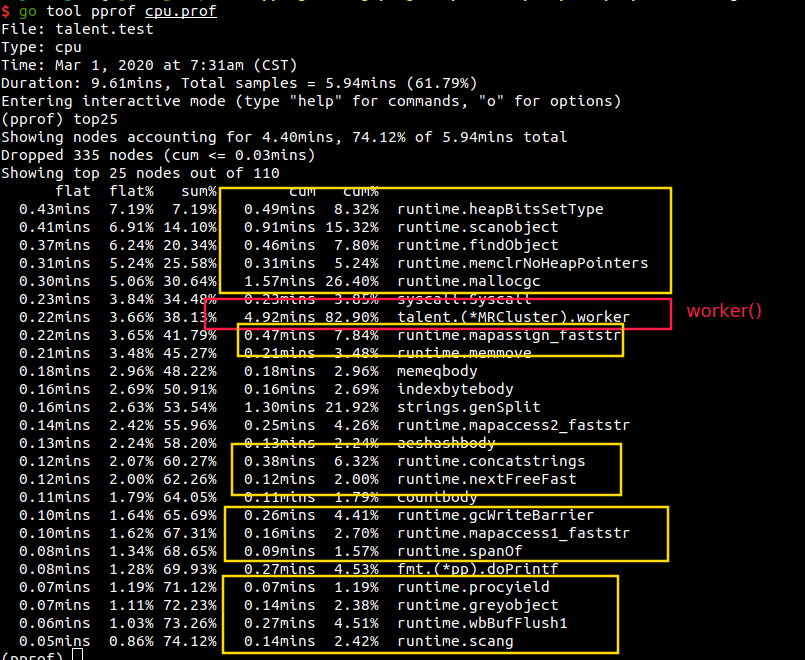

关于仅仅测试`1GB`数据耗时较长的问题，需要解释下：机器每次跑的时候感觉不稳定，不论是
`urltop10_example.go`还是`urltop10.go`，都是如此，这不是本次分析的关键点。总之，若要进一步优化，则需
要好好思考如何降低`GC`耗时。
