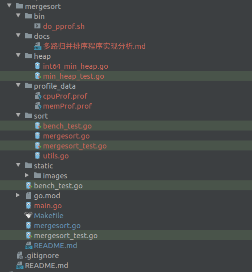

## 文件结构介绍



- **bin**：存放shell脚本。其中的`do_profile.sh`用于生成CPU和memory相关的profile文件，文件存放在`profile_data`中
- **docs**：存放多路归并排序的程序(性能)分析文档
- **heap**：存放了`MergeSort()`用到的最小堆的代码及其测试文件
- **profile_data**：用于存放多路归并排序的pprof性能分析的CPU和memory的profile文件
- **sort**：这是另外一份`MergeSort`的性能测试及基础单元测试(对各个函数的测试)
- **static**：用于存放Markdown文件所需的图片
- **mergesort**：根目录。新增了`main.go`文件，主要用于执行`MergeSort()`生成存放于profile_data下的CPU和memory数据的`profile`文件。
  
另外，在`Makefile`文件中新增了测试代码覆盖率的命令`make cover`，执行可查看`MergeSrot()`设计的代码覆盖率。

## Introduction

This is the Merge Sort home work for PingCAP Talent Plan Online of week 1.

There are 16, 000, 000 int64 values stored in an unordered array. Please
supplement the `MergeSort()` function defined in `mergesort.go` to sort this
array.

Requirements and rating principles:
* (30%) Pass the unit test.
* (20%) Performs better than `sort.Slice()`.
* (40%) Have a document to describe your idea and record the process of performance optimization with `pprof`.
* (10%) Have a good code style.

NOTE: **go 1.12 is required**

## How to use

Please supplement the `MergeSort()` function defined in `mergesort.go` to accomplish
the home work.

**NOTE**:
1. There is a builtin unit test defined in `mergesort_test.go`, however, you still
   can write your own unit tests.
2. There is a builtin benchmark test defined in `bench_test.go`, you should run
   this benchmark to ensure that your parallel merge sort is fast enough.


How to test:
```
make test
```

How to benchmark:
```
make bench
```
