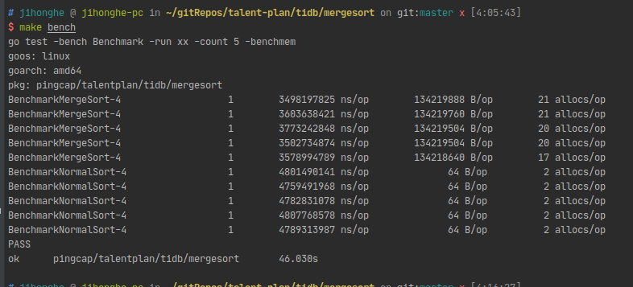
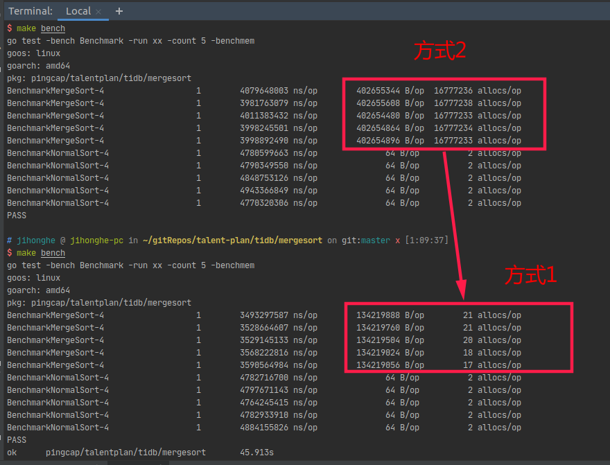
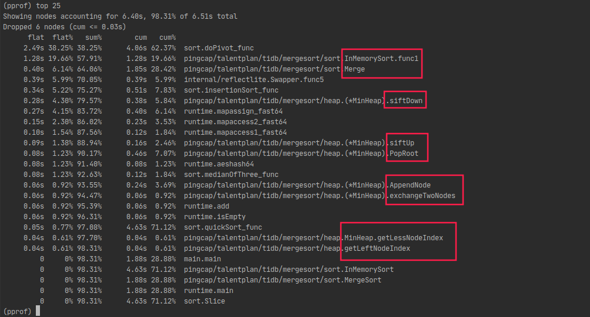
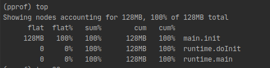

# 多路归并排序程序实现分析

## 1. 实现思路

### 1.1. 程序执行结果



### 1.2. 思路阐述

#### 1.2.1. 总体思路概述

1. 将给出的无序序列按照机器CPU核数(设为m个)分割成m个子序列，对这m个子序列执行并行排序
2. 利用最小堆进行多路归并，将这m个有序的子序列归并为一个有序子序列(设为dst)
3. 将有序序列dst的元素`copy`到无序序列切片中

#### 1.2.2. 关键问题说明

1. **为什么要将无序序列分割成与机器CPU核数相等的若干子序列？**
因为这样能够充分利用机器的所有CPU并行排序这些子序列。若启动的`goroutine`数目小于CPU数，则有空闲的CPU未利用；若`goroutine`数目大于CPU数目，则会出现并发，在处理效率上并没有什么提高。综上，`goroutine`数目应与机器的CPU数目相等。

2. **最小堆的设计**

```go
type MinHeap struct {
    elementsArrayIds []int
    elements []int64
    length int
    capacity int
}
```

最小堆的数据结构如上所示。与一般的最小堆的成员所不同的是，笔者在堆中加入了一个记录每一个元素所属的有序子序列对应所在的二维切片的下标的成员`elementsArrayIds`。为什么需要它？在回答这个问题之前，需要思考另一个问题：我们知道，在利用最小堆执行多路归并的过程中，取出堆顶元素后需要往堆中插入一个新的元素(如果还存在未处理的序列元素)。通常的处理是：若取出的堆顶元素所在的子序列仍有未处理元素，则从该序列中取出新元素插入堆中，否则从其他子序列中取元素。那么，**我们如何知道取出的堆顶元素所在的子序列呢？**
针对这个问题，笔者尝试了两种方式：方式1是在最小堆结构成员中维护一个记录最小堆存放堆结点的底层序列上的元素所在的待归并子序列；方式2是设计一个可追踪所属待归并子序列的元素的结构体，如下所示：

```go
type TraceableElement struct {
    value int64
    arrayId int
}
```

经过实际的验证，两种方式均可行，但是两者在内存分配带来的资源消耗上有着明显的差距，其测试结果对比如下：

简单分析下，使用方式2在创建可追踪的堆节点元素时会产生大量的内存分配，其内存分配次数与待排序的无序序列的元素数相等。基于此，方式1的设计正好解决了方式2的设计上带来的大量内存分配的资源消耗问题。
  
以上即为最小堆的设计由来。

## 2. 性能分析

### 2.1. CPU使用情况分析



针对图中红框圈出的函数，可以将其分属为两类：一是对子序列的排序操作，如`InMemorySort()`；二是归并操作，例如`Merge()`中调用的`PopRoot()`。前者的耗时主要就是排序，其中最大耗时为调用`sort`包中的`doPivot_func()`，这两者占了整个多路归并排序耗时的大部分比例；而对于有序子序列的多路归并操作，耗时占比较前者少。在多路归并操作中，由于需要不断地从最小堆取出堆顶元素并调整堆，因此与调整最小堆相关的两个函数`siftDown()`和`siftUp()`占用时间比例较多。
  
基于以上分析，对于将原序列分割成若干个有序子序列的操作，提高其排序效率的关键在于提高并行处理数，即可以适当提高处理子序列排序的并行数(非并发数)。对于归并操作，经过笔者测试发现，随着最小堆对应的完全二叉树高度的增加，其效率反而越低，主要耗时在于堆的调整。可见，在多路归并的处理中，要适当控制好最小堆的高度才能尽可能高效地执行归并。综上，要提高对子序列的排序效率，需要更多的并行排序处理，但是为了兼顾后续的多路归并，需要平衡子序列的数目。针对此，可以借鉴二路归并排序中的一个**优化思路**：对于一个有序子序列A和有序子序列B，若子序列A的末位元素小于子序列B的首元素，则可合并二者成为一个新的子序列。以上即为对整个排序处理的性能分析。

### 2.2. 内存使用情况分析



从上图可知，在针对最小堆中的节点所属的子序列的追踪方式优化后(1.2.2中的最小堆的设计)，除了待排序序列占用的内存，其他的内存消耗相对而言是很小的。
